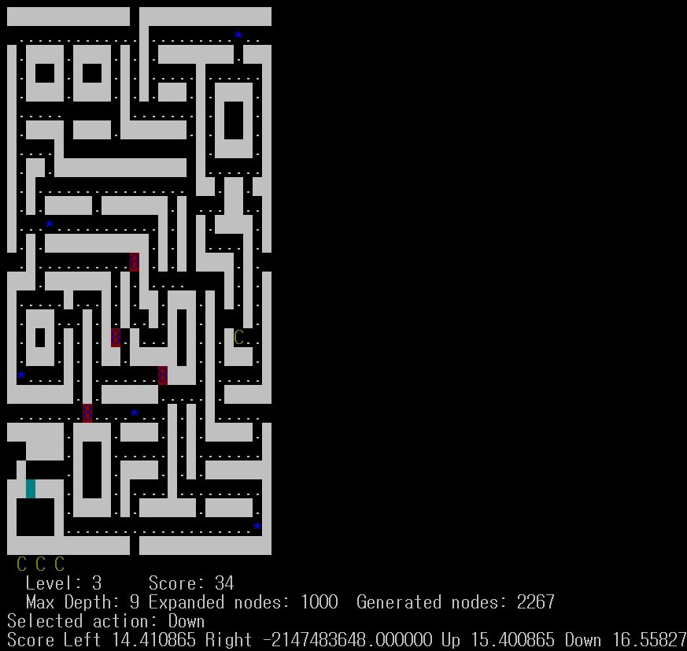

# AI-Pacman
Pacman bot using Dijkstra's Algorithm in C

The Pacman bot uses Dijkstra's algorithm to find the optimal move that will achieve the highest score at each step. The number of nodes that the pacman considers (explores) in coming up with the optimal move is limited by the <budget>. 1000 will do reasonably good with satisfactory speed. 
  
Running the program with level 3, ai, max propagation and budget of 1000 looks something like this:

To execute this juicy pacman bot, you need to have a linux terminal / ubuntu.

Run the following command to install ncurses which is needed to run the game:

sudo apt-get install libncurses5-dev libncursesw5-dev 

Run the bot by:

./pacman <level> <ai/ai pause> <max/avg> budget
